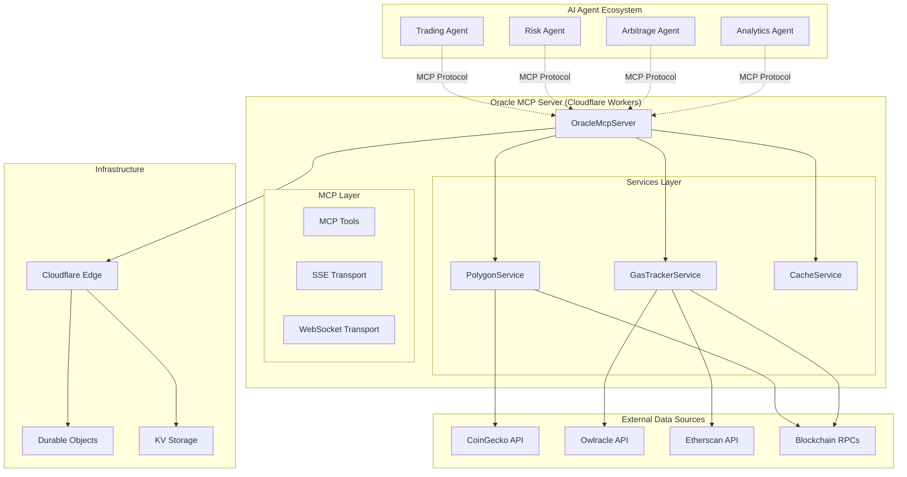

# 🔮 Oracle MCP: Technical Deep Dive & Architecture Guide

## 🎯 Overview & Vision

The Oracle MCP Server represents a paradigm shift in how AI agents interact with blockchain data. This system enables autonomous agents to discover, communicate, and collaborate through standardized protocols while accessing real-time blockchain metrics.

### Why Oracle MCP Matters

In the rapidly evolving AI agent ecosystem, data silos prevent effective collaboration. Traditional APIs require agents to implement custom integrations, creating friction and limiting interoperability. Oracle MCP solves this by:

1. **Standardizing Data Access**: Using MCP protocol for universal agent communication
2. **Enabling Agent Discovery**: Agents can automatically discover and utilize oracle capabilities
3. **Facilitating Collaboration**: Multiple agents can coordinate trading, arbitrage, and DeFi strategies
4. **Ensuring Reliability**: Production-grade infrastructure with fallbacks and caching

### Real-World Applications

- **DeFi Trading Bots**: Agents coordinating complex multi-step arbitrage strategies
- **Risk Management**: Agents monitoring portfolio exposure across multiple protocols
- **Market Making**: Automated liquidity provision based on real-time gas and price data
- **Cross-Chain Bridges**: Agents optimizing bridge transactions based on network conditions
- **MEV Strategies**: Coordinated front-running and sandwich attack detection/execution

## 🏗️ System Architecture

### High-Level Architecture



### Core Components Deep Dive

#### 1. OracleMcpServer (Main Entry Point)

```typescript
export class OracleMcpServer extends McpHonoServerDO<Env> {
  private cache: CacheService;
  private polygonService: PolygonService;
  private gasTracker: GasTrackerService;

  constructor(ctx: DurableObjectState, env: Env) {
    super(ctx, env);
    // Service initialization with fallback mechanisms
  }

  configureServer(server: McpServer): void {
    // Backup initialization ensures services always exist
    setupServerTools(server, { cache, polygonService, gasTracker });
  }
}
```

**Key Features:**
- **Durable Object**: Persistent state across requests with automatic scaling
- **Backup Initialization**: Services are re-created if missing (handles edge cases)
- **Environment Injection**: Configuration through Cloudflare Workers environment

#### 2. Service Layer Architecture

**PolygonService**: Token Price Management
```typescript
class PolygonService {
  async getTokenPrice(symbol: string, network: Network): Promise<TokenPrice> {
    try {
      // Primary: CoinGecko Pro API
      if (this.config.coingeckoApiKey) {
        return await this.getTokenPriceFromCoinGecko(symbol);
      }
    } catch (error) {
      // Fallback: CoinGecko Public API
      return await this.getTokenPriceFromPublicAPI(symbol);
    }
  }

  async checkHealth(): Promise<boolean> {
    // Health monitoring with ping endpoint
    return fetch('https://api.coingecko.com/api/v3/ping').then(r => r.ok);
  }
}
```

**GasTrackerService**: Multi-Network Gas Monitoring
```typescript
class GasTrackerService {
  async getGasPrice(network: Network): Promise<GasPrice> {
    switch (network) {
      case Network.POLYGON:
        return await this.getPolygonGasPrice();
      case Network.ETHEREUM:
        return await this.getEthereumGasPrice();
    }
  }

  private async getPolygonGasPrice(): Promise<GasPrice> {
    try {
      // Primary: Owlracle API (specialized for Polygon)
      return await this.getPolygonGasFromOwlracle();
    } catch {
      // Fallback: Direct RPC call
      return await this.getPolygonGasFromRPC();
    }
  }
}
```

**CacheService**: Intelligent Caching Layer
```typescript
class CacheService {
  private cache = new Map<string, CacheEntry>();
  private ttl: number;

  generateKey(...parts: string[]): string {
    return parts.join(':');
  }

  set(key: string, value: any, customTTL?: number): void {
    const expiry = Date.now() + (customTTL || this.ttl);
    this.cache.set(key, { value, expiry });

    // Background cleanup to prevent memory leaks
    this.scheduleCleanup();
  }
}
```

## 🔗 MCP Protocol Integration

### Tool Registration & Response Format

All tools return standardized MCP responses:

```typescript
// MCP-compliant response format
return {
  content: [{
    type: "text",
    text: JSON.stringify({
      success: true,
      data: result,
      message: "Operation completed successfully"
    })
  }]
};
```

### Available MCP Tools

#### 1. getTokenPrice
```typescript
// Input Schema
interface GetTokenPriceInput {
  symbol: string;      // BTC, ETH, MATIC, USDC, etc.
  network?: string;    // polygon, ethereum (default: polygon)
  source?: string;     // coingecko, quicknode (optional)
}

// Response Schema
interface TokenPriceResponse {
  success: boolean;
  data: {
    symbol: string;
    price: number;
    priceUsd: number;
    timestamp: number;
    source: string;
    marketCap?: number;
    volume24h?: number;
    percentChange24h?: number;
    cached?: boolean;
  };
  message: string;
}
```

#### 2. getGasPrice
```typescript
// Input Schema
interface GetGasPriceInput {
  network?: string;    // polygon, ethereum (default: polygon)
}

// Response Schema
interface GasPriceResponse {
  success: boolean;
  data: {
    network: string;
    standard: number;    // Standard gas price in gwei
    fast: number;        // Fast gas price in gwei
    instant: number;     // Instant gas price in gwei
    timestamp: number;
    unit: 'gwei';
    cached?: boolean;
  };
}
```

#### 3. getHistoricalPrice
```typescript
// Input Schema
interface GetHistoricalPriceInput {
  symbol: string;
  date: string;        // YYYY-MM-DD format
  network?: string;
}

// Response includes price, volume, and market data for the specified date
```

#### 4. getMultiNetworkGasPrice
```typescript
// Returns gas prices for all supported networks simultaneously
interface MultiNetworkGasResponse {
  success: boolean;
  data: {
    polygon: GasPrice;
    ethereum: GasPrice;
    // Additional networks as they're added
  };
}
```

#### 5. publishToContract (Simulation)
```typescript
interface PublishToContractInput {
  eventName: string;
  contractAddress: string;  // 0x... format
  data: object;            // Event payload
}

// Simulates contract interaction - can be extended for real transactions
```

#### 6. healthCheck
```typescript
// No input parameters
interface HealthCheckResponse {
  success: boolean;
  data: {
    polygon: boolean;      // PolygonService health
    gasTracker: boolean;   // GasTrackerService health
    cache: number;         // Cache entry count
    timestamp: number;
  };
}
```

## 🚀 Performance & Optimization

### Caching Strategy

| Data Type | TTL | Justification |
|-----------|-----|---------------|
| Token Prices | 30 seconds | Balance between freshness and API limits |
| Gas Prices | 30 seconds | Gas changes frequently, especially on Ethereum |
| Historical Data | 24 hours | Historical data doesn't change |
| Health Checks | No cache | Always need current status |

### API Rate Limiting & Fallbacks

```typescript
// Multi-tier fallback system
class PolygonService {
  async getTokenPrice(symbol: string): Promise<TokenPrice> {
    // Tier 1: CoinGecko Pro (higher limits, better data)
    if (this.config.coingeckoApiKey) {
      try {
        return await this.getTokenPriceFromCoinGecko(symbol);
      } catch (error) {
        console.warn('CoinGecko Pro failed, falling back');
      }
    }

    // Tier 2: CoinGecko Public (rate limited)
    try {
      return await this.getTokenPriceFromPublicAPI(symbol);
    } catch (error) {
      // Tier 3: Could add DEX aggregator APIs here
      throw new Error(`All price sources failed for ${symbol}`);
    }
  }
}
```

### Memory Management

- **Cache Cleanup**: Automatic background cleanup of expired entries
- **Memory Limits**: Cloudflare Workers 128MB memory limit considered
- **Durable Object State**: Persistent across invocations for caching benefits

## 🤖 Agent Collaboration Patterns

### Pattern 1: Price Discovery & Trading Signal Generation

```mermaid
sequenceDiagram
    participant PDA as Price Discovery Agent
    participant OMS as Oracle MCP Server
    parameter TSA as Trading Signal Agent
    participant EA as Execution Agent

    loop Every 30 seconds
        PDA->>OMS: getTokenPrice({symbol: "ETH"})
        OMS->>PDA: {price: 3500, change: +2.5%}
        PDA->>OMS: getGasPrice({network: "ethereum"})
        OMS->>PDA: {fast: 25 gwei}

        PDA->>TSA: Price Alert: ETH breaking resistance
        TSA->>OMS: getMultiNetworkGasPrice()
        OMS->>TSA: Gas prices across networks

        TSA->>EA: Trade Signal: Buy ETH on Polygon (lower gas)
        EA->>OMS: publishToContract({trade data})
    end
```

### Pattern 2: Cross-Chain Arbitrage Detection

```typescript
// Agent A: Price Monitor
const ethPricePolygon = await getTokenPrice({symbol: "ETH", network: "polygon"});
const ethPriceEthereum = await getTokenPrice({symbol: "ETH", network: "ethereum"});

// Agent B: Gas Cost Calculator
const polygonGas = await getGasPrice({network: "polygon"});
const ethereumGas = await getGasPrice({network: "ethereum"});

// Agent C: Arbitrage Calculator
const arbitrageProfit = calculateArbitrage(
  ethPricePolygon, ethPriceEthereum,
  polygonGas, ethereumGas,
  bridgeCosts
);

if (arbitrageProfit > threshold) {
  // Agent D: Execution Agent executes trade
}
```

### Pattern 3: DeFi Protocol Monitoring

```typescript
// Risk Management Agent
const assets = ["ETH", "WBTC", "USDC", "MATIC"];
const portfolioData = await Promise.all(
  assets.map(asset => getTokenPrice({symbol: asset}))
);

const gasEstimates = await getMultiNetworkGasPrice();

// Calculate portfolio risk and rebalancing costs
const riskMetrics = calculateRisk(portfolioData, gasEstimates);

if (riskMetrics.urgent) {
  // Trigger emergency rebalancing
  await publishToContract({
    eventName: "EmergencyRebalance",
    contractAddress: "0x...",
    data: { portfolioData, gasEstimates }
  });
}
```

## 🛡️ Production Deployment & Security

### Environment Configuration

```jsonc
{
  "name": "oracle-mcp-production",
  "compatibility_date": "2025-02-11",
  "compatibility_flags": ["nodejs_compat"],

  "vars": {
    "COINGECKO_API_KEY": "production-key-here",
    "QUICKNODE_API_KEY": "production-quicknode-key",
    "POLYGON_RPC_URL": "https://polygon-mainnet.g.alchemy.com/v2/YOUR-KEY",
    "CACHE_TTL_SECONDS": "30"
  },

  "observability": {
    "enabled": true,
    "head_sampling_rate": 1
  },

  "limits": {
    "cpu_ms": 1000
  }
}
```

### Security Best Practices

1. **API Key Management**: Store in Cloudflare Workers secrets
2. **Rate Limiting**: Implement per-agent session limits
3. **Input Validation**: Zod schemas validate all inputs
4. **Error Handling**: Never expose internal errors to agents
5. **Monitoring**: Track usage patterns and detect anomalies

### Monitoring & Observability

```typescript
// Health monitoring endpoints
const healthMetrics = {
  uptimeSeconds: Date.now() - startTime,
  cacheHitRate: cacheHits / totalRequests,
  apiCallsPerMinute: apiCallCount / minutesSinceStart,
  errorRate: errorCount / totalRequests,
  averageResponseTime: totalResponseTime / requestCount
};
```

## 🔮 Future Enhancements

### Planned Features

1. **Real Contract Integration**: Move from simulation to actual smart contract publishing
2. **Additional Networks**: Support for Arbitrum, Optimism, BSC, Avalanche
3. **DeFi Protocol Integration**: Direct integration with Uniswap, AAVE, Compound
4. **Advanced Analytics**: Technical indicators, trend analysis, volatility metrics
5. **WebSocket Streaming**: Real-time price feeds for high-frequency trading agents
6. **Agent Authentication**: Secure agent identification and authorization
7. **Usage Analytics**: Detailed metrics and billing for API usage

### Extensibility Points

```typescript
// Easy to add new networks
export enum Network {
  POLYGON = 'polygon',
  ETHEREUM = 'ethereum',
  ARBITRUM = 'arbitrum',    // Future
  OPTIMISM = 'optimism',    // Future
  BSC = 'bsc'               // Future
}

// Easy to add new data sources
interface PriceSource {
  getName(): string;
  getPrice(symbol: string): Promise<TokenPrice>;
  isHealthy(): Promise<boolean>;
}
```

### Agent Ecosystem Growth

As more agents utilize the Oracle MCP:

1. **Network Effects**: More agents = more valuable data patterns
2. **Collaborative Intelligence**: Agents learn from each other's strategies
3. **Market Efficiency**: Arbitrage opportunities get discovered faster
4. **Risk Distribution**: Multiple agents can share and hedge risks

## 🎓 Getting Started Guide for Developers

### Building Your First Oracle-Connected Agent

```typescript
// 1. Connect to Oracle MCP
import { createMcpClient } from '@modelcontextprotocol/sdk';

const client = createMcpClient({
  transport: 'sse',
  url: 'https://your-oracle-mcp.workers.dev/sse'
});

// 2. Implement your agent logic
class TradingAgent {
  async analyzeProfitability() {
    // Get current prices
    const ethPrice = await client.callTool('getTokenPrice', {
      symbol: 'ETH',
      network: 'polygon'
    });

    // Check gas costs
    const gasPrice = await client.callTool('getGasPrice', {
      network: 'polygon'
    });

    // Your trading logic here
    return this.calculateStrategy(ethPrice, gasPrice);
  }

  async executeStrategy(strategy) {
    // Publish to smart contract
    await client.callTool('publishToContract', {
      eventName: 'TradeExecution',
      contractAddress: '0x...',
      data: strategy
    });
  }
}
```

### Best Practices for Agent Development

1. **Graceful Degradation**: Handle Oracle downtime gracefully
2. **Caching**: Implement agent-side caching for frequently used data
3. **Error Recovery**: Retry failed requests with exponential backoff
4. **Data Validation**: Always validate Oracle responses
5. **Testing**: Use health check endpoint to verify connectivity

### Contributing to Oracle MCP

1. **Fork the repository**
2. **Add new data sources** in the services layer
3. **Implement new MCP tools** following existing patterns
4. **Add comprehensive tests**
5. **Submit pull request** with documentation

The Oracle MCP Server represents the future of agent-to-agent collaboration in the DeFi space. By providing standardized, reliable access to blockchain data, it enables a new generation of intelligent, autonomous financial agents.