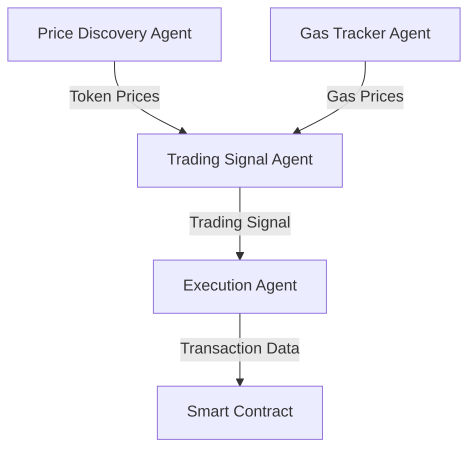

# 🔮 Oracle MCP Server

A production-ready MCP (Model Context Protocol) server that acts as a blockchain data oracle for AI agents. This server provides real-time blockchain metrics (gas prices, token prices, historical data) and formats them for AI consumption. Built on the Nullshot framework with Cloudflare Workers and designed to enable seamless agent-to-agent collaboration through the standardized MCP protocol.

> **Built for Track 1a: MCP/Agent** - Enables AI agents to discover and collaborate with each other through real-time blockchain data.

## 🌟 Features

- **🪙 Real-time Token Prices**: Get current prices from CoinGecko and other sources with automatic fallbacks
- **⛽ Gas Price Tracking**: Monitor gas prices across Polygon, Ethereum, and other EVM networks
- **📈 Historical Data**: Access historical price data for trend analysis and backtesting
- **🤝 Smart Contract Integration**: Simulate publishing data to smart contracts (expandable for real transactions)
- **🌐 Multi-Network Support**: Support for Ethereum, Polygon, and other EVM networks with easy extensibility
- **🚀 Performance Optimized**: Built-in caching layer with configurable TTL to optimize API calls and reduce latency
- **🔗 MCP Protocol**: Full compatibility with Model Context Protocol for agent discovery and communication
- **☁️ Cloudflare Workers**: Serverless deployment with global edge distribution and auto-scaling
- **🛡️ Production Ready**: Robust error handling, fallbacks, health checks, and comprehensive logging

## 🚀 Quick Start

### Prerequisites

- Node.js 18+
- npm or pnpm
- Optional: API keys for enhanced functionality

### Local Testing

#### Option 1: MCP Inspector (Recommended)

```bash
# Install dependencies
npm install

# Start both MCP Inspector and development server
npm run dev

# In SSE option change the sse port to current one and then you can connect
```

#### Option 2: MCP Integration

1. **Build the project:**
```bash
npm run build
```

2. **Add to agent config:**

```json
{
"servers": {
  "oraclix": {
    "url": "http://localhost:63791/sse",
    "type": "http"
  }
},
"inputs": []
}

//change the port to your current sse port
```


### Available Tools

Once connected, you can use these MCP tools:

- `getTokenPrice` - Get real-time token prices (ETH, BTC, MATIC, etc.)
- `getGasPrice` - Get current gas prices for networks
- `getHistoricalPrice` - Get historical price data
- `getMultiNetworkGasPrice` - Get gas prices across multiple networks
- `publishToContract` - Simulate contract interactions
- `healthCheck` - Check system health and API status

### Development
cd examples/oracle-mcp

# Install dependencies
pnpm install

# Start development server with MCP inspector
pnpm dev

# 🎯 Access Points:
# • Oracle Server: http://localhost:8787 (port varies)
# • MCP SSE Endpoint: http://localhost:8787/sse. (port varies)
# • MCP Inspector: http://localhost:6274 (auto-opens, port varies)
```

### Using the MCP Inspector

The MCP inspector provides a web interface to test all Oracle tools:

1. Run `pnpm dev`
2. Browser opens automatically to the MCP inspector
3. Test tools like `getTokenPrice`, `getGasPrice`, `healthCheck`
4. View real-time responses and debug MCP communication

### Deployment

```bash
# Build and deploy to Cloudflare Workers
pnpm build
pnpm deploy
```

### Configuration

Set environment variables in `wrangler.jsonc`:

```jsonc
{
  "vars": {
    "COINGECKO_API_KEY": "your-coingecko-api-key", // Optional but recommended
    "QUICKNODE_API_KEY": "your-quicknode-api-key", // Optional
    "POLYGON_RPC_URL": "https://polygon-rpc.com",
    "CACHE_TTL_SECONDS": "30"
  }
}
```

## Available MCP Tools

### getTokenPrice

Fetch current token price from various sources.

```typescript
{
  symbol: string,      // Token symbol (BTC, ETH, MATIC, etc.)
  network?: string,    // Blockchain network (default: polygon)
  source?: string      // Price source (optional)
}
```

### getGasPrice

Get current gas prices for a blockchain network.

```typescript
{
  network?: string     // Network name (default: polygon)
}
```

### getHistoricalPrice

Retrieve historical price data for a specific date.

```typescript
{
  symbol: string,      // Token symbol
  date: string,        // Date in YYYY-MM-DD format
  network?: string     // Blockchain network (optional)
}
```

### getMultiNetworkGasPrice

Get gas prices for multiple networks simultaneously.

```typescript
{} // No parameters required
```

### publishToContract

Simulate publishing data to a smart contract.

```typescript
{
  eventName: string,          // Event name
  contractAddress: string,    // Contract address (0x...)
  data: object               // Event data
}
```

### healthCheck

Check the health status of all oracle services.

```typescript
{} // No parameters required
```

## Agent Integration

### Example: Agent A queries token price

```typescript
import { getTokenPrice } from 'oracle-mcp';

const price = await getTokenPrice({
  symbol: 'ETH',
  network: 'polygon'
});

console.log(\`ETH price: $\${price.data.priceUsd}\`);
```

### Example: Agent B gets gas prices for transaction

```typescript
import { getGasPrice } from 'oracle-mcp';

const gasPrice = await getGasPrice({
  network: 'polygon'
});

console.log(\`Gas price: \${gasPrice.data.fast} gwei\`);
```

## Cross-Agent Trading Signals

The oracle server enables sophisticated agent-to-agent collaboration:

1. **Price Discovery Agent**: Continuously monitors token prices and volatility
2. **Gas Optimization Agent**: Tracks gas prices across networks for optimal transaction timing
3. **Trading Signal Agent**: Combines price and gas data to generate trading recommendations
4. **Execution Agent**: Receives signals and executes trades when conditions are met

### Example Workflow



## Architecture

### Components

- **OracleMcpServer**: Main server class extending McpHonoServerDO
- **PolygonService**: Token price integration with CoinGecko and other APIs
- **GasTrackerService**: Gas price monitoring across multiple networks
- **CacheService**: In-memory caching with TTL support
- **MCP Tools**: Standardized interfaces for agent communication

### Data Sources

- **CoinGecko API**: Primary token price source
- **Owlracle**: Gas price tracking for Polygon
- **Etherscan**: Gas prices for Ethereum
- **RPC Endpoints**: Direct blockchain queries as fallback

### Caching Strategy

- Token prices: 30 seconds TTL
- Gas prices: 30 seconds TTL
- Historical data: 24 hours TTL
- Health checks: No caching

## Error Handling

The oracle server implements robust error handling:

- **API Fallbacks**: Multiple data sources with automatic failover
- **Rate Limiting**: Respects API rate limits and implements backoff
- **Validation**: Input validation using Zod schemas
- **Logging**: Comprehensive error logging for debugging

## Testing

```bash
# Run tests
pnpm test

# Test specific functionality
curl http://localhost:8787/sse

# Test MCP tools using the inspector
pnpm dev
# Visit http://localhost:6274 for MCP inspector (auto-opens)
```