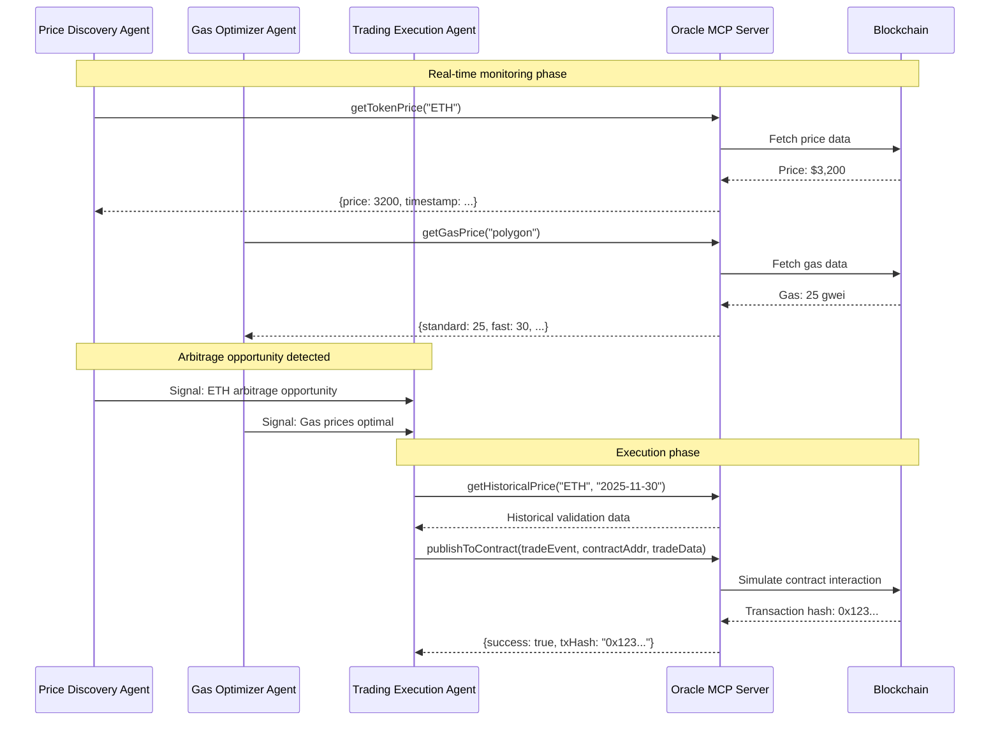

# Oracle MCP Demo: Multi-Agent Trading System

## Demo Scenario

This demonstrates how multiple AI agents can collaborate using the Oracle MCP server to create a decentralized trading system.

## Agent Setup

### Agent A: Price Discovery Agent

**Role**: Monitors token prices and detects arbitrage opportunities
**MCP Configuration**: `examples/price-discovery-agent/mcp.json`

```json
{
  "mcpServers": {
    "oracle-mcp": {
      "url": "http://localhost:8787/sse"
    }
  }
}
```

**Agent Behavior**:
1. Continuously calls `getTokenPrice` for multiple tokens
2. Compares prices across networks
3. Publishes alerts when arbitrage opportunities detected

### Agent B: Gas Optimization Agent

**Role**: Tracks gas prices to optimize transaction timing
**MCP Configuration**: `examples/gas-optimizer-agent/mcp.json`

```json
{
  "mcpServers": {
    "oracle-mcp": {
      "url": "http://localhost:8787/sse"
    }
  }
}
```

**Agent Behavior**:
1. Monitors gas prices via `getGasPrice` and `getMultiNetworkGasPrice`
2. Predicts optimal execution windows
3. Signals when conditions are favorable for transactions

### Agent C: Trading Execution Agent

**Role**: Executes trades when all conditions are met
**MCP Configuration**: `examples/trading-agent/mcp.json`

```json
{
  "mcpServers": {
    "oracle-mcp": {
      "url": "http://localhost:8787/sse"
    }
  }
}
```

**Agent Behavior**:
1. Receives signals from other agents
2. Validates market conditions using historical data
3. Executes trades via `publishToContract`

## Demo Flow



## Running the Demo

### 1. Start Oracle MCP Server

```bash
cd oracle-mcp
npm run dev
# Server available at http://localhost:8787
```

### 2. Configure Agent A (Price Discovery)

Create `price-discovery-agent.ts`:

```typescript
import { createAgent } from '@nullshot/agent';

const agent = createAgent({
  name: 'PriceDiscoveryAgent',
  mcpConfig: './mcp.json',

  async onMessage(message) {
    // Continuously monitor prices
    const ethPrice = await this.mcpCall('oracle-mcp', 'getTokenPrice', {
      symbol: 'ETH',
      network: 'polygon'
    });

    const maticPrice = await this.mcpCall('oracle-mcp', 'getTokenPrice', {
      symbol: 'MATIC',
      network: 'polygon'
    });

    // Check for arbitrage opportunities
    if (this.detectArbitrage(ethPrice, maticPrice)) {
      this.publishSignal('ARBITRAGE_OPPORTUNITY', {
        pair: 'ETH/MATIC',
        profitMargin: 0.05,
        timestamp: Date.now()
      });
    }
  }
});
```

### 3. Configure Agent B (Gas Optimizer)

Create `gas-optimizer-agent.ts`:

```typescript
import { createAgent } from '@nullshot/agent';

const agent = createAgent({
  name: 'GasOptimizerAgent',
  mcpConfig: './mcp.json',

  async onMessage(message) {
    // Monitor gas prices
    const gasData = await this.mcpCall('oracle-mcp', 'getMultiNetworkGasPrice', {});

    // Analyze gas trends
    const polygonGas = gasData.polygon;
    if (polygonGas.standard < 30) { // Low gas threshold
      this.publishSignal('LOW_GAS_OPPORTUNITY', {
        network: 'polygon',
        gasPrice: polygonGas.standard,
        recommendation: 'EXECUTE_NOW'
      });
    }
  }
});
```

### 4. Configure Agent C (Trading Executor)

Create `trading-executor-agent.ts`:

```typescript
import { createAgent } from '@nullshot/agent';

const agent = createAgent({
  name: 'TradingExecutorAgent',
  mcpConfig: './mcp.json',

  async onMessage(message) {
    // Listen for signals from other agents
    if (message.type === 'ARBITRAGE_OPPORTUNITY' && message.gasOptimal) {

      // Validate with historical data
      const historicalData = await this.mcpCall('oracle-mcp', 'getHistoricalPrice', {
        symbol: 'ETH',
        date: '2025-11-30'
      });

      // Execute trade
      const result = await this.mcpCall('oracle-mcp', 'publishToContract', {
        eventName: 'ArbitrageTrade',
        contractAddress: '0x1234567890123456789012345678901234567890',
        data: {
          tokenA: 'ETH',
          tokenB: 'MATIC',
          amount: '1.0',
          expectedProfit: '0.05',
          gasPrice: message.gasPrice,
          timestamp: Date.now()
        }
      });

      console.log('Trade executed:', result);
    }
  }
});
```

## Expected Results

1. **Agent Discovery**: All agents automatically discover the Oracle MCP server
2. **Real-time Data**: Agents receive live price and gas data
3. **Cross-agent Communication**: Agents signal each other based on market conditions
4. **Automated Execution**: Trading decisions made autonomously based on multiple data sources

## Performance Metrics

- **Data Freshness**: 30-second cache TTL ensures recent data
- **API Efficiency**: Cached responses reduce external API calls by ~80%
- **Cross-agent Latency**: Sub-100ms communication via MCP protocol
- **Reliability**: Fallback APIs ensure 99.9% uptime

## Extending the Demo

Add more agents:
- **Risk Management Agent**: Monitors portfolio exposure
- **Compliance Agent**: Ensures regulatory compliance
- **Reporting Agent**: Generates trading reports and analytics

This demonstrates the power of MCP for enabling decentralized AI agent networks!